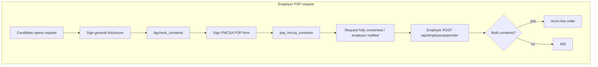

# PSP — Two Required Disclosures (Not Combinable)

## Corrected requirement (user clarification)

PSP is **two forms**, and they **cannot be combined** into one document, but the applicant **must complete both**:

1. **General background check disclosure** — the existing [`BackgroundCheckDisclosure.tsx`](src/components/BackgroundCheckDisclosure.tsx) path (Key Background / FCRA / same family as MVR). This stays as-is for PSP employer requests; it is **not** replaced by the PSP-only form.

2. **FMCSA PSP Disclosure and Authorization** — the mandatory NIC/FMCSA language from the PDF (verbatim, standalone).

Neither form’s language may be merged with the other in a single “combined” disclosure UI or single stored document that mixes clauses.

## Implications

- **Employer-requested PSP:** Candidate signs the general disclosure first (or second — order can be UX choice, but both required), then signs the FMCSA PSP standalone form. **Employer PSP order APIs must block** until **both** records exist for that driver + company (and ideally tied to the same `candidate_requests` row where applicable).

- **Self-order PSP:** Same rule: both disclosures before payment / `/api/psp/order`. Today `bgcheck_consents.request_id` is `NOT NULL`; self-order may need a **migration** (nullable `request_id` + synthetic handling) **or** a parallel **self-order** consent store for form (1). Pick the smallest schema change that preserves auditability — implementer decides in code review.

- **Request completion:** If signing form (1) currently marks `candidate_requests` `completed` and notifies the employer, that is **too early** for PSP until form (2) is also signed. Plan: introduce an explicit second consent record and only treat the PSP request as “fully consented” (and optionally only then mark `completed`, or keep `completed` but add a second flag — prefer **don’t mark employer-actionable complete until both** to avoid accidental live orders).

## Architecture (high level)

## Files (anticipated)

| Area | Action |
|------|--------|
| New migration | `psp_fmcsa_consents` (or name per convention) — stores FMCSA form signature, `form_version`, snapshot `form_data`, `driver_user_id`, `company_id` / `request_id` as needed |
| New component | `PspFmcsaDisclosureForm.tsx` — verbatim FMCSA text only inside the legal document region |
| [`CandidateRequestsSection.tsx`](src/components/CandidateRequestsSection.tsx) | Two separate CTAs or a guided two-step flow for `psp_order`; never one merged form |
| [`src/app/api/candidate/bgcheck-consent/route.ts`](src/app/api/candidate/bgcheck-consent/route.ts) | Possibly defer marking `candidate_requests` completed for PSP until second consent exists (coordinate with new FMCSA consent API) |
| New API | `POST /api/psp/fmcsa-consent` (name TBD) — persist FMCSA-only consent |
| [`src/app/api/employer/psp/order/route.ts`](src/app/api/employer/psp/order/route.ts) | Assert **both** consent types |
| [`src/components/PspOrderForm.tsx`](src/components/PspOrderForm.tsx) | Replace single checkbox with both disclosures before pay |
| [`src/app/api/psp/order/route.ts`](src/app/api/psp/order/route.ts) | Assert **both** consent types for self-order |

## Compliance note

No PSP test/sandbox — any Accio submission after consent checks pass is **live** with FMCSA. UI copy should reinforce that ordering is irreversible once submitted.

## Open item

Confirm with Key Background / Lana: exact display text for blank “Prospective Employer” on **self-order** (user previously suggested self-request style wording).
