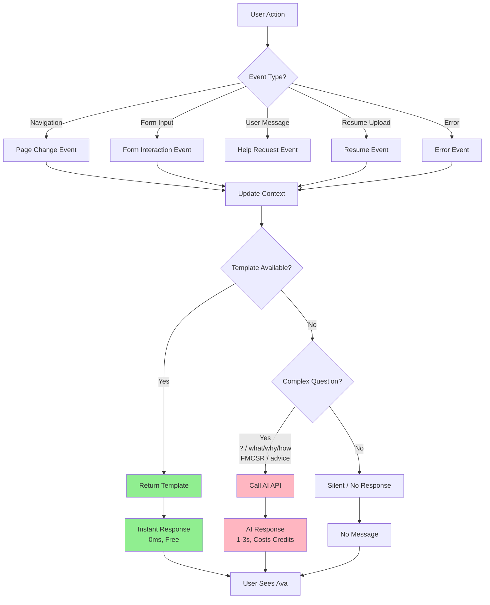
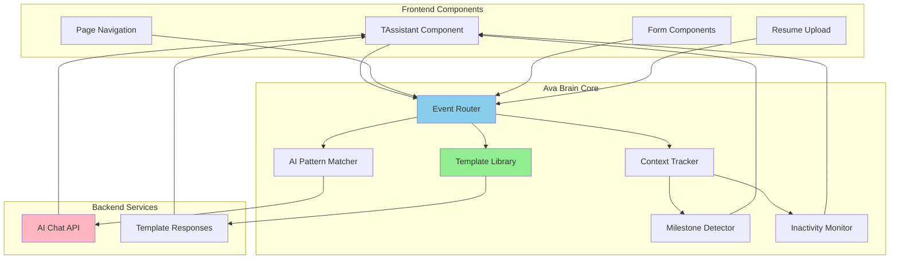
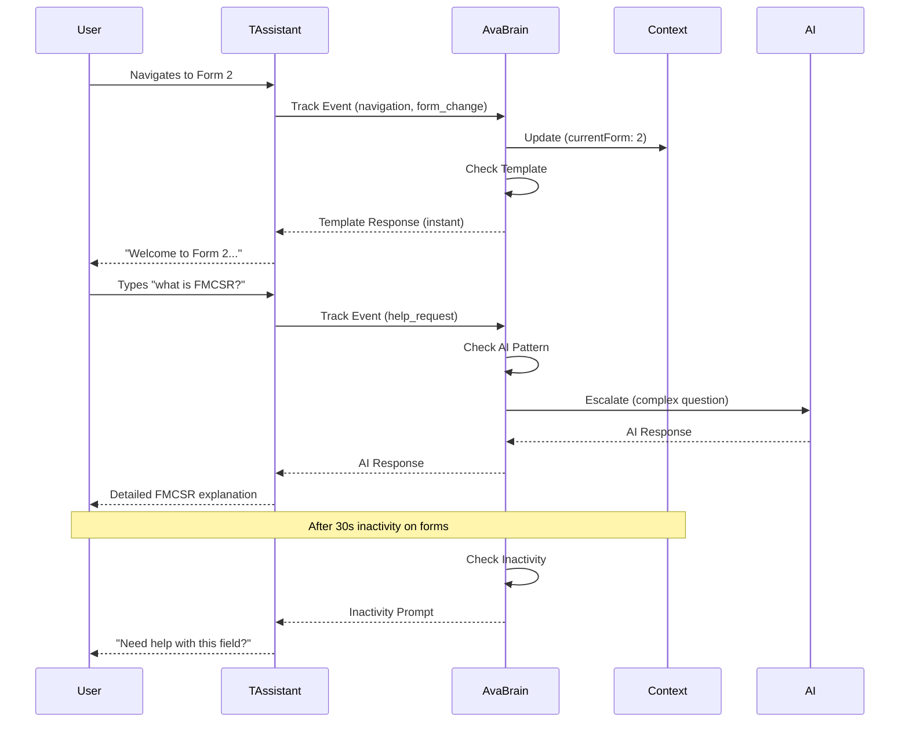

# 🧠 Ava Brain - Smart Routing Architecture

## System Overview

```
┌─────────────────────────────────────────────────────────────────────────┐
│                         USER INTERACTION                                 │
│  (Navigation, Form Input, Questions, Chat Messages)                    │
└───────────────────────────────┬─────────────────────────────────────────┘
                                │
                                ▼
┌─────────────────────────────────────────────────────────────────────────┐
│                    AVA BRAIN EVENT ROUTER                                │
│  ┌──────────────────────────────────────────────────────────────────┐  │
│  │  User Action → Event Created → Route Decision                   │  │
│  └──────────────────────────────────────────────────────────────────┘  │
└───────────────────────────────┬─────────────────────────────────────────┘
                                │
                ┌───────────────┴───────────────┐
                │                               │
                ▼                               ▼
    ┌───────────────────────┐      ┌───────────────────────┐
    │   TEMPLATE MATCH?     │      │   AI PATTERN MATCH?    │
    │   (80% of cases)      │      │   (20% of cases)       │
    └───────────┬───────────┘      └───────────┬───────────┘
                │                               │
                │ YES                           │ YES
                ▼                               ▼
    ┌───────────────────────┐      ┌───────────────────────┐
    │  TEMPLATE LIBRARY      │      │   AI API CALL          │
    │  • 50+ pre-written     │      │   • Complex questions  │
    │  • Instant (0ms)       │      │   • Regulations        │
    │  • Free                │      │   • Personalized       │
    │  • Consistent tone     │      │   • 1-3 seconds        │
    └───────────┬───────────┘      └───────────┬───────────┘
                │                               │
                └───────────────┬───────────────┘
                                │
                                ▼
                    ┌───────────────────────┐
                    │   AVA RESPONSE        │
                    │   (User sees "Ava")   │
                    └───────────────────────┘
```

## Decision Flow



## Component Architecture



## Cost & Performance Comparison

```
┌─────────────────────────────────────────────────────────────────────┐
│                    BEFORE (Always AI)                                │
├─────────────────────────────────────────────────────────────────────┤
│  User Action → AI API Call → Response                               │
│  • Every action costs credits                                       │
│  • 1-3 second delay                                                │
│  • 100% AI calls                                                    │
│  • High cost, slow UX                                              │
└─────────────────────────────────────────────────────────────────────┘

┌─────────────────────────────────────────────────────────────────────┐
│                    AFTER (Smart Routing)                            │
├─────────────────────────────────────────────────────────────────────┤
│  User Action → Template Check → AI Only If Needed                  │
│  • ~80% use templates (free, instant)                              │
│  • ~20% use AI (when intelligence needed)                           │
│  • 0ms response for templates                                      │
│  • 80% cost reduction                                              │
│  • Better UX (instant feedback)                                    │
└─────────────────────────────────────────────────────────────────────┘

Cost Savings: ~80% fewer AI calls
Speed Improvement: Instant responses for 80% of interactions
User Experience: Feels "omniscient" but actually efficient
```

## Event Categories & Templates

```
┌─────────────────────────────────────────────────────────────────────┐
│  EVENT CATEGORIES          │  TEMPLATE EXAMPLES                    │
├────────────────────────────┼───────────────────────────────────────┤
│  navigation                │  "Welcome to Form 2..."               │
│  form_interaction          │  "✅ Saved! Your progress..."        │
│  resume                    │  "📤 Uploading your resume..."        │
│  help_request              │  → AI (complex questions)              │
│  error                     │  "⚠️ Connection issue. Try again?"    │
│  success                   │  "🎉 Form 1 Complete!"              │
│  inactivity                │  "Need help with this field?"        │
│  conflict                  │  "⚠️ Profile Conflict Detected..."     │
│  milestone                 │  "🎉 Milestone unlocked!"             │
└────────────────────────────┴───────────────────────────────────────┘
```

## Tracking System



## Real-World Example Flow

```
User Journey: Building Resume → DOT Application

1. User navigates to Resume page
   └─> Ava Brain: "Ready to work on your resume!..."

2. User uploads resume
   └─> Ava Brain: "📤 Uploading your resume..."
   └─> Ava Brain: "✅ Resume uploaded! Now I'll read through it..."

3. User navigates to Forms
   └─> Ava Brain: "Welcome to Form 1: Personal Information..."

4. User types "what is FMCSR?"
   └─> Ava Brain: [AI Call] "FMCSR stands for Federal Motor Carrier..."

5. User completes Form 1
   └─> Ava Brain: "🎉 Form 1 Complete! You're 1/3 of the way..."

6. User idle for 30 seconds on Form 2
   └─> Ava Brain: "Need help with this field? I can explain..."

7. User types "thanks"
   └─> Ava Brain: [Silent - no response needed]
```

## Key Metrics

| Metric | Before | After | Improvement |
|--------|--------|-------|-------------|
| **AI API Calls** | 100% | ~20% | **80% reduction** |
| **Response Time** | 1-3s | 0ms (80%) | **Instant for most** |
| **Cost per Session** | High | Low | **~80% savings** |
| **User Experience** | Slow | Fast | **Feels instant** |
| **Template Coverage** | 0% | 80% | **Massive improvement** |

## File Structure

```
src/
├── lib/
│   └── ava-brain.ts              # Core routing engine
│       ├── Event Types
│       ├── Template Library (50+)
│       ├── AI Pattern Matcher
│       ├── Context Tracker
│       └── Milestone Detector
│
├── contexts/
│   └── AvaBrainContext.tsx       # React context (optional)
│
└── components/
    └── TAssistant.tsx            # Integrated with Ava Brain
        ├── Page Tracking
        ├── Inactivity Detection
        ├── Form Completion Tracking
        └── Smart Message Routing
```

---

**Result:** Ava appears "omniscient" to users, but you're only paying for intelligence when it's actually needed! 🧠✨
